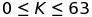
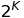
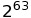
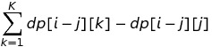
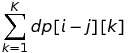
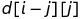
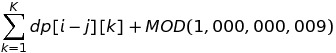
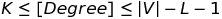

# Samsung Collegiate Programming Cup (SCPC 2016)
## 3N + 1
3N + 1에 대해서는 [Collatz conjecture](https://en.wikipedia.org/wiki/Collatz_conjecture)를 참고하면 좋을 것 같다.
Programming Challenges (알고리즘 트레이닝 북)에서 1번 문제로 다루고 있을 정로도 한번 쯤은 풀어봤을 문제이다.
본 문제에서는 K()가 주어졌을 때, 값이 1에 도달 할 때까지의 길이가 될 수 있는 수의 최솟값과 최댓값을 찾아야 한다.

최솟값은 1에서부터 거슬러 올라가면서 추척할 수도 있으나, 본 문제에서 주어진 K의 범위에 해당하는 값은 1200 이내의 범위에서 찾을 수 있으므로 간단하게 for문을 이용하여 계산해주면 된다.
최댓값 같은 경우, 사실 문제를 풀어보면 에 해당하는 값이 된다는 것을 알 수 있다. (한 길이에서 수의 크기가 줄어드는 경우는 2로 나눠질 때 뿐이기 때문이다.)

문제에서 가장 많이 오류를 범할 수 있는 것이 자료형인데, 은 long long 범위도 넘어가기에 unsigned long long을 활용하여 풀어주면 된다.

## 징검다리
각 각의 돌에 0부터 N까지의 수를 붙이고 건너려고 한다. 만약에, i번 돌에 위치하고 있다면, i + 1, i + 2, ..., i + K번 으로 이동할 수 있다.
맨 마지막 돌은 반드시 건너야 한다는 조건은 점화식에 따라서는 체크해 줄 필요가 있지만, 두가지 제약 조건을 가지고 있다.
1. 지뢰가 있는 돌은 밟을 수 없다.
2. 현재 위치에서 점프할 때, 이전 위치에서 점프한 것과 같은 K만큼 점프할 수 없다.

경우의 수를 체크해주는 문제로, Dynamic Programming(DP)로 해결할 수 있다.

dp[i][j] =  현재 위치가 i이며, i - j에서 i로 점프해 왔을 때의 길을 건너는 방법 수
점화식을 위와 같이 세우고 문제를 풀면 된다.

지뢰가 있는 돌은 무시하면 되고, 그 외의 돌에 대한 점화식을 풀어주면 된다.
dp[i][j] =  로 문제를 풀 수 있다.
이렇게 문제를 풀 경우, 50,000번, 100번, 100번 (각 각, N, K, K번)의 루프를 돌게 문제를 풀 경우 500,000,000번의 연산을 수행해야 하기 때문에 TLE를 받게 된다. 그러므로, K번의 합 계산에 대해서, Memoization 해주면 된다.

또, 이 문제는 계속 나머지 연산을 하며 계산을 해주게 되는데, 이 보다 작아질 수 있게 되므로, 값이 음수가 됨을 방지하기 위해서 dp[i][j]를 계산해 줄 때, 에 MOD 값(1,000,000,009)을 더해주는 것이 포인트이다. ()

두서없이 적었지만, 2번의 for문을 통해서 문제를 해결 할 수 있다.

## 바이러스
문제 자체는 복잡해 보이나, 그래프가 주어지고 모든 정점의 차수가  만들기 위해서 최소로 몇 개의 정점을 제거해야 하는 지를 구하는 문제이다.

이 문제는 Greedy 방식으로 접근해서 풂련된다. 차수가 K 미만이거나, 를 초과하는 경우 점점을 지워가면서 풀면 된다.
물론, 이 방법을 증명해야 하겠지만, Greedy는 증명하기가 어렵기 때문에 생략하도록 한다.

## 대피소
다익스트라를 활용하는 기본적인 최단거리 문제인데, 이 문제에서는 모든 정점에 대해서 다익스트라를 돌려서 만점을 받을 수 없다는 함정이 있다. (TLE가 나온다.)
그러므로, 시작점을 여러 개(대피소가 시작점) 되도록 다익스트라를 바꿔준 후, 1번의 다익스트라를 돌려 최단 거리를 구하면 된다.
다음과 같은 흐름으로 문제를 해결하면 된다.

1. 다익스트라를 구현한다.
2. 다익스트라를 모든 대피소를 시작점으로 하여 돌린다.
3. distance[next] > distance[current] + next_distance인 경우에는 대피소와 거리를 갱신해준다.
4. distance[next] = distance[current] + next_distance인 경우에는, 다음에 이동할 위치의 대피소 번호가 현재 대피소 번호보가 큰 경우에 대피소를 갱신해준다.
5. 거리의 합, 대피소 번호의 합을 구해준다.

## 구두제작
장인들이 구두를 주어진 조건을 만족하면서 모두 제작할 수 있는지를 판단하는 문제다.
전형적인 네트워크 플로우 문제다. 물론 Greedy 적으로 접근하여 문제를 풀어도 점수를 받을 수 있다. (실제로 SCPC 1차 예선 때 그랬기도 하지만.)

다음과 같은 흐름으로 문제를 해결하면 된다.

1. Source에서 장인으로 근무 시간만큼의 간선을 그린다. (capacity: e - s)
2. 장인에서 시간으로 향하는 간선을 그린다. (capacity: 1)
3. 시간에서 구두로 향하는 간선을 그린다. (capacity: 1)
4. 구두에서 Sink로 향하는 간선을 그린다. (capacity: f - a)

그 후 Ford Fulkerson을 이용하여 Maximum Flow를 구해주고, 이 값이 구두 제작 시간의 총 합과 같은지 판단하면 된다.
