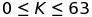
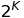
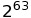
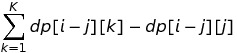
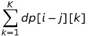
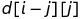
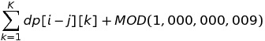
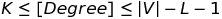

# Samsung Collegiate Programming Cup (SCPC 2016)
## 3N + 1
3N + 1 문제는 [Collatz conjecture](https://en.wikipedia.org/wiki/Collatz_conjecture)를 참고하면 된다.
Programming Challenges (알고리즘 트레이닝 북)에서 1번 문제에서도 다루고 있을 정도로 유명한 문제다.
본 문제는 가 주어졌을 때, 값이 1이 도달 할 때 까지의 길이가 될 수 있는 수들의 최솟값과 최댓값을 찾는 문제다.
알고리즘 트레이닝 북에서는 특정 수를 입력하면 그 길이를 출력하는 것으로 기억하는데 이 문제는 길이가 주어졌을 때의 수를 찾는 문제로 변형됬다.

최솟값은 1부터 역추척 하면서 풀어가면 된다. 재귀를 활용하여 1 -> 2 -> ... -> N (길이: K) 이런 식으로 가지치기를 하면서 구할 수 있다.
물론, 이 문제는 최댓값 또한 재귀로 풀 수 있다.

작성한 코드에서는, 최솟값은 for문을 활용하여 계산해 주었다. 주어진 K 범위가 63이기 때문에 1200, 1500정도의 수를 검사해주면 모두 찾을 수 있고 이를 memoization 해준 후 최솟값을 구해주는 방식으로 코딩했다.
최댓값 같은 경우, 사실 문제를 풀어보면 알지만 이 된다는 것을 알 수 있다. 이는 한 길이에서 수의 크기를 줄일 수 있는 방법은 2로 나눌 때 밖에 없기 때문이다.

최솟값 최댓값을 출력해주면 된다. 그런데, 은 long long 범위를 넘어가게 되고, unsigned long long으로 문제를 해결해주면 된다.
std::pow 등의 라이브러리 함수를 사용해도 되지만, 2의 K승은 비트연산으로 간단하게 해결할 수 있으므로 굳이 불필요한 함수를 사용할 필요는 없다.

```c++
dp[K] // minimum
1ULL << K // maximum
```

보면 알겠지만 casting 할 필요없이 numeric literal을 활용했다.

## 징검다리
전형적인 DP 문제라고 생각한다. 문제를 보자마자, DP 풀이밖에 생각이 안났기 때문에 점화식을 세우고 이에 맞춰서 문제를 풀어가면 된다.
사실 이 문제는 DP로 풀지 않으면 TLE 받게 된다. (부분점수를 받을 수 있는 범위까진 받을 수 있을 것 같다.)

문제 자체는 심플하다.
1. 각 돌에 0부터 N까지 수를 붙이고 건넌다.
2. i번 돌에 위치하고 있을 때, i + 1, i + 2, ..., i + K번 돌로 이동할 수 있다.

문제에서 제시한 제약 조건은 다음과 같다.
1. 지뢰가 있는 돌은 밟은 수 없다.
2. 현재 위치에서 점프 할 때, 이전 위치에서 점프한 것과 같은 K 만큼의 점프는 불가능하다.

점화식을 어떻게 세우느냐에 따라서 다르겠지만 맨 마지막 돌은 반드시 밟아야 하기 때문에 dp[N][...] = 1 로 셋팅해줘도 무방하다.

dp[i][j] = 현재 위치 (i)를 오기 위해서 (i - j) 위치에서 (i)로 점프해 올 수 있는 방법의 수
이전 위치에서 현재 위치로 건너올 방법의 수를 체크해주는 경우로 점화식을 세웠기에 N번째 돌을 미리 체크할 필요가 없어 생략했다. (반복문을 통해서 어차피 1로 체크된다.)

지뢰가 있는 돌은 무시하면 되고, 그 외의 돌에 대해서 방법의 수를 계산해주면 된다.

즉, dp[i][j] = 의 점화식을 계산해주면 된다.
위의 점화식을 풀 경우, 최대 50,000번, 100번, 100번의 3중 루프를 돌게 되는데, 500,000,000번의 연산은 당연히 TLE이다.
그러므로 방법을 좀 더 생각해 주어야 하는데, 합을 계산하는 for문을 한번만 계산하도록 고치면 된다.

즉 2번의 for문을 통해서 점화식을 계산할 수 있고, 50,000번, 100번 계산하게 되므로 최대 5,000,000번의 연산을 하므로 제한시간 내에 문제를 풀 수 있다.

참! MOD 연산에 주의하자.
의 경우 MOD 연산을 해주며 계산되기 때문에  보다 값이 작아지게 되는 경우가 존재할 것이다.
그러므로 음수가 될 수 있는데 이를 방지하기 위해서는 와 같이 MOD 값을 더해주는 방법으로 해결 할 수 있다.

## 바이러스
문제 자체는 복잡해 보이나, 그래프가 주어지며 모든 정점의 차수가 를 만족하게 만들기 위해서는 몇 개의 정점을 제거해야하는지, 이 최솟값을 구하는 문제다.
Greedy한 방식으로 접근해서 풀어갈 수 있다. 즉, 차수가 K 미만이거나, 를 초과하는 경우에 정점을 지우면 된다.

## 대피소
문제를 보면 딱, 다익스트라를 쓰면 된다는 것을 직감할 수 있을 것이다. 어차피 최단거리를 계산하는 알고리즘은 PS에서 대부분 다익스트라를 이용하면 된다.
그러나, 모든 정점에 대해서 여러번 다익스트라를 돌리게 되면 TLE가 나게되고 만점을 받을 수 없다.

이를 해결하기 위해서, 대피소를 시작점으로 하여 1번의 다익스트라를 돌려주게 되면 제한시간 내에 문제를 해결 할 수 있다.

1. 다익스트라를 모든 대피소를 시작점으로 하여 1번 돌린다.
2. distance[next] > distance[current] + next_distance인 경우에는 최단 거리를 갱신하고 가장 가까운 대피소 번호를 지정해준다.
3. distance[next] = distance[current] + next_distance인 경우에는 최단 거리는 변화하지 않으므로 가장 가까운 대피소가 어딘지 살펴보면 된다. 쉽게 말해서 임의의 대피소까지의 거리가 동일하다면 문제의 조건에 따라서 대피소 번호가 작은 경우가 정답이 되기 때문에 이 경우를 체크해주라는 의미다.
4. 거리의 합, 대피소 번호의 합을 구하면 정답이 된다.

위와 같은 흐름으로 계산해주면 된다. priority_queue를 활용하여 다익스트라를 구현하고, 1번의 실행을 통해서 정답을 구할 수 있다.

## 구두제작
장인들이 구두를 주어진 조건을 만족하면서 모두 제작할 수 있는지를 판단하는 문제다.
전형적인 Network Flow 문제다. 이 문제는 Greedy적인 흐름으로 접근해도 점수는 받을 수 있다. (실제로 SCPC 1차 예선 볼 때 그렇게 코딩했었다.)

아무튼, Network Flow로 해결할 수 있도록 그래프를 잘 만들어주면 된다.
1. [Source]에서 [장인]으로 capacity: e - s 만큼의 간선을 그린다.
2. [장인]에서 [시간]으로 capacity: 1인 간선을 그린다.
3. [시간]에서 [구두]로 capacity: 1인 간선을 그린다.
4. [구두]에서 [Sink]로 capacity: f - a 만큼의 간선을 그린다.

Ford Fulkerson, Edmonds-Karps, Dinic 등 구현하기 쉬운 방법을 활용하여 그래프에 대한 최대 유량을 구해주면 된다.
Maximum Flow를 구하고 이 값이 구두의 제작 시간의 총 합과 같은지 판단하여 true, false를 출력하면 된다.

### 후기
삼성 코드그라운드 문제들은 재미있는 문제가 많아서 좋다. 이번 예선은 작년도('15) 보다 수준도 높아졌고 문제가 탄탄해진 느낌이라 좋았던 것 같다.
그런데 삼성 코드그라운드 C++98 환경이 너무 싫다. 쓸데없이 코드만 길어지고 가독성도 낮아져서 C++0x, c++1y 같은 환경에 대해 문의했는데 조만간 업그레이드 할 예쩡이라고 하더라.
빠르게 개선하였으면 좋겠다. 그리고 더 많은 컴파일러나 인터프리터를 지원해줬으면 좋겠다.

대표적으로 Javascript(Node.js), Python(PyPy 라던지), PHP 등과 같은 주류 언어에 대한 지원이 있으면 좋을 것 같다.
아무튼 예전 2차나 본선 문제가 나오면 추가적으로 더 작성해보도록 하겠다. 누가 볼지는 모르지만 도움이 되기를 :)
